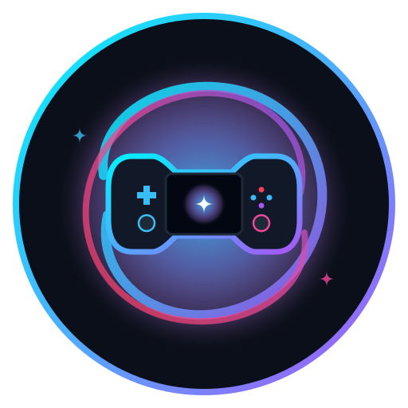

<p align="center">
  
</p>

<h1 align="center">🌌 NebulaDeck</h1>

<p align="center">
  <strong>The Ultimate Fullscreen Big Picture Native Gaming Launcher for Linux & KDE Plasma 6</strong>
</p>

<p align="center">
  <a href="#-key-features"></a>
  <a href="#-key-features"></a>
  <a href="#-key-features"></a>
  <a href="#-license"></a>
</p>

---

## 📖 Overview

**NebulaDeck** is a native, fullscreen, console-inspired application launcher crafted specifically for Linux handhelds, gaming laptops, and touchscreen tablets running **KDE Plasma 6**.

Built directly in **QtQuick / QML** and accelerated by the hardware GPU SceneGraph, NebulaDeck delivers a silky smooth **120 FPS** experience with near-zero CPU footprint (< 0.1% CPU), full gamepad/touch gesture support, automatic online banner scrapers, and 14 handcrafted themes.

---

## ✨ Key Features

- 🎮 **Console Big Picture Experience**: Fullscreen dashboard with interactive hero carousel, customizable cover-flow, and categorized app drawer.
- ⚡ **Ultra-Low CPU Footprint (< 0.1% CPU)**: Backgrounds and transforms execute purely on hardware GPU SceneGraph nodes with zero frame stutter on high-refresh 120Hz displays.
- 🖼️ **Automatic Online Hero Banners**: Built-in scraper asynchronously queries **Steam Store CDN** and **Flathub AppStream APIs**, caching high-res artwork locally into `~/.local/share/plasma-deck-launcher/banners/` for instant offline access.
- 🧠 **Smart Dynamic Prioritization**: Games and apps are automatically ranked and badged (`PIÙ GIOCATO`, `PREFERITO`, `EMULATORE`) based on recorded playtime and user favorites.
- 📱 **Clean Peek View**: Swipe up from the bottom or tap the drag handle to toggle between a minimalist single-row peek view and the full categorized application grid.
- 🎨 **14 Handcrafted Visual Themes**:
  - 🌊 **Cosmic Ocean**: Ethereal, slow-flowing sinuous ocean ribbons.
  - 🌌 **Nordic Aurora**: Undulating mathematical sinusoidal glowing ribbons.
  - 🌸 **Lo-Fi Weather**: Cozy pastel sunset, Studio Ghibli fireflies, anime sparkles, and gentle rain.
  - 🌄 **Wilderness Sunset**: Vertical poster coverflow with scenic alpine mountain ridges.
  - 💥 **Manga Comic**: Stylized angled panels with dynamic comic slash ribbons.
  - 🕹️ **Retro 8-Bit LCD**: Authentic green dot-matrix screen with scanlines.
  - 🎮 **Hybrid Console**: Joy-accented dark glass aesthetic.
  - 🖤 **OLED Obsidian**: Pure black background for maximum battery life.
  - 🌆 **Synthwave '84**, ☀️ **Circadian Cycle**, 🌧️ **Drops**, 🫧 **Glass Bubbles**, 🚀 **Starfield Warp**, and 🌙 **Night Shift**.
- 🔊 **Sub-Millisecond Sound Engine**: Tactile sound effects for focus changes, activation, drawer swipes, and category tabs.
- 🔋 **Live Hardware Telemetry**: Real-time battery wattage, voltage, temperature, and live FPS / memory monitor.
- 🌐 **Multilingual**: Native translations for **Italian**, **English**, **Spanish**, **French**, and **German**.

---

## 🚀 Installation

### Option 1: Quick One-Liner (Automated Install)

Run the installation script directly from your terminal:

```bash
git clone https://github.com/your-username/nebuladeck.git
cd nebuladeck
./package/install.sh
```

### Option 2: Manual Installation via `kpackagetool6`

```bash
# 1. Clone repository
git clone https://github.com/your-username/nebuladeck.git

# 2. Install plasmoid into your KDE Plasma 6 environment
kpackagetool6 --type Plasma/Applet --install nebuladeck

# 3. If updating an existing version:
kpackagetool6 --type Plasma/Applet --upgrade nebuladeck

# 4. Restart Plasma Shell to apply changes
systemctl --user restart plasma-plasmashell.service
```

---

## 🎨 Creating Custom Themes

NebulaDeck features an extensible, polymorphic theming engine that allows you to customize background shaders, tile aspect ratios, and color palettes.

👉 Check out our complete guide: [**THEMING_GUIDE.md**](./THEMING_GUIDE.md)

---

## 📂 Project Structure

```
nebuladeck/
├── contents/
│   ├── config/              # XML configuration schemas
│   ├── scripts/             # Python banner scraper & hardware telemetry
│   ├── assets/              # Logos, sound effects, vector glyphs
│   └── ui/                  # QtQuick / QML components
│       ├── DeckDashboard.qml       # Main fullscreen window
│       ├── HeroCarousel.qml        # Horizontal hero banner carousel
│       ├── DynamicBackground.qml   # GPU background shader engine
│       ├── SettingsDrawer.qml      # Theme & configuration drawer
│       ├── HeaderStatusBar.qml     # Status bar & telemetry
│       └── i18n.js                 # Multi-language dictionary
├── metadata.json            # Plasmoid package definition (API 6.0)
├── THEMING_GUIDE.md         # Developer guide for creating themes
└── README.md                # Project documentation
```

---

## 🛠️ Remote Deployment to Handheld / Tablet (Developers)

If you are developing remotely on a Linux tablet or handheld device (e.g. postmarketOS / SteamOS / Bazzite):

```bash
# Deploy to device over SSH and restart plasmashell
rsync -avz --exclude '.git' ./ user@<DEVICE_IP>:~/.local/share/plasma/plasmoids/org.kde.plasma.decklauncher/
ssh user@<DEVICE_IP> "systemctl --user restart plasma-plasmashell.service"
```

---

## 📜 License

NebulaDeck is open-source software licensed under the **MIT License**.
